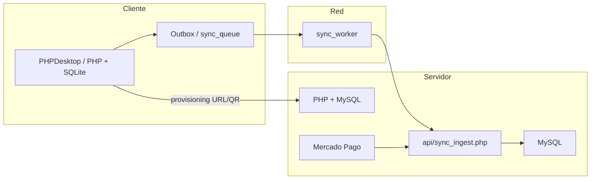
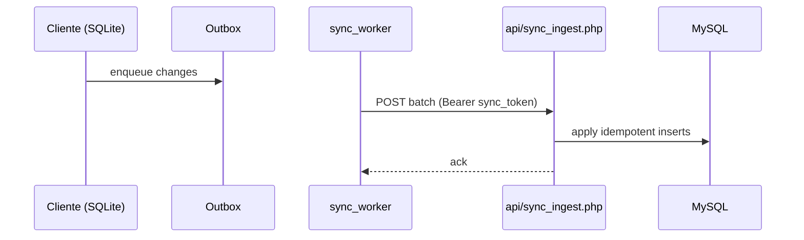
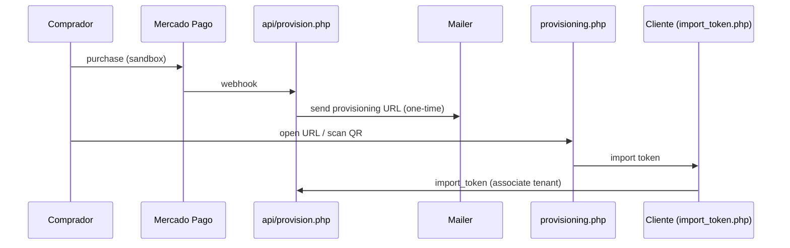

# Diagramas del proyecto (Mermaid)

## Arquitectura (alto nivel)

```mermaid
graph LR
  subgraph Cliente
    C[PHPDesktop / PHP + SQLite]
    O[Outbox / sync_queue]
  end
  subgraph Red
    SW[sync_worker]
  end
  subgraph Servidor
    S[PHP + MySQL]
    API[api/sync_ingest.php]
    DB[MySQL]
    MP[Mercado Pago]
  end

  C --> O --> SW --> API --> DB
  MP --> API
  C -->|provisioning URL/QR| S
```

## Flujo de sincronización

```mermaid
sequenceDiagram
  participant Client as Cliente (SQLite)
  participant Out as Outbox
  participant Worker as sync_worker
  participant API as api/sync_ingest.php
  participant ServerDB as MySQL

  Client->>Out: enqueue changes
  Worker->>API: POST batch (Bearer sync_token)
  API->>ServerDB: apply idempotent inserts
  API-->>Worker: ack
```

## Flujo de provisión

```mermaid
sequenceDiagram
  participant Buyer as Comprador
  participant MP as Mercado Pago
  participant API as api/provision.php
  participant Email as Mailer
  participant Provision as provisioning.php
  participant Client as Cliente (import_token.php)

  Buyer->>MP: purchase (sandbox)
  MP->>API: webhook
  API->>Email: send provisioning URL (one-time)
  Buyer->>Provision: open URL / scan QR
  Provision->>Client: import token
  Client->>API: import_token (associate tenant)
```
