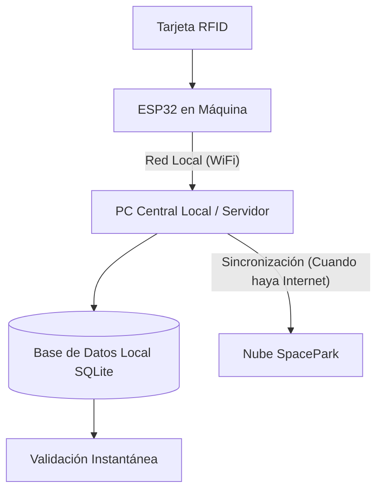

# 🕹️ Expansión: Sistema de Tarjetas RFID para Arcade

Este documento describe la arquitectura técnica y el plan de implementación para integrar tarjetas de proximidad (RFID/NFC) con el sistema SpacePark, permitiendo el control automático de créditos en las máquinas de juego mediante hardware **ESP32**.

---

## 1. Identificación y "Vinculación" de Dispositivos (Pairing)

Para que el sistema sea extremadamente fácil y flexible, utilizaremos un modelo de **Vinculación N-a-1** (Varios lectores para un solo juego):

- **ID de Hardware (4 letras)**: Cada placa ESP32 tiene un identificador corto único (ej: `XJ92`, `KLR4`).
- **Entidad "Máquina" (Lógica)**: En SpacePark, creas una "Máquina" (ej: "Mesa Air Hockey Doble") y le asignas su precio.
- **Vinculación Múltiple**: 
    1. El sistema permite vincular **varios IDs de Hardware a una misma Máquina**.
    2. Si es una máquina doble, vinculas los lectores `AZ01` y `AZ02` a la máquina "Carreras GTR".
    3. **Beneficio**: No necesitas crear dos máquinas iguales. Ambas descontarán el mismo precio y las ventas se sumarán al reporte de la misma máquina física.
- **Auto-Detección**: Los lectores nuevos aparecen en una lista de "Dispositivos no asignados" para que los vincules con un clic.

> [!TIP]
> **Simplicidad de Gestión**: Si cambias el precio de la "Máquina", automáticamente todos los lectores vinculados a ella (ya sean 1, 2 o 4) se actualizarán al instante.

---

---

## 2. Arquitectura de Conexión (Modo Local/Offline-First)

El sistema está diseñado para funcionar **sin internet**. Los terminales ESP32 se comunican directamente con el **Puesto Central Local** (la PC donde corre SpacePark Desktop) a través de tu red WiFi interna.



### Ventajas del Modo Local:
- **Latencia Cero**: La respuesta es instantánea porque los datos no viajan a internet.
- **Inmunidad a Fallos**: Si se corta el internet en la zona, el salón de juegos sigue operando normalmente.
- **Privacidad**: El tráfico de datos de las máquinas no sale de tu local.

---

## 3. Hardware Requerido (Por Máquina)

| Componente | Función | Precio Estimado |
| :--- | :--- | :--- |
| **ESP32 DevKit V1** | Cerebro del sistema con conexión WiFi. | $5 - $8 USD |
| **Lector RFID RC522** | Lee tarjetas de 13.56 MHz (NFC). | $3 - $5 USD |
| **Módulo Relevador (1 canal)** | Simula el pulsado del botón de la ficha. | $2 - $3 USD |
| **Display OLED 0.96"** | Muestra saldo, precio del juego y mensajes al cliente. | $4 - $6 USD |
| **Fuente 5V 2A** | Alimentación del sistema. | $3 - $5 USD |

---

## 4. Interfaz de Usuario (Display OLED)

El visor es fundamental para la transparencia con el cliente. La lógica del display debe seguir este flujo:

1.  **Estado Reposo**: Muestra el nombre del juego y el valor de la ficha (ej: `SpacePark - Ficha: $500`).
2.  **Lectura de Tarjeta**: Muestra "Validando..." brevemente.
3.  **Transacción Exitosa**: Muestra "¡Juega!" y debajo el saldo restante (ej: `Saldo: $2500`).
4.  **Error/Saldo Insuficiente**: Muestra mensaje de error claro y el saldo actual si es posible.

---

## 5. Pago Directo por QR (Fase Secundaria)

Como evolución, el visor OLED puede mostrar un **QR dinámico** (usando una librería de dibujo de QR en ESP32).
- El cliente escanea el QR desde su App de Banco/Mercado Pago.
- El servidor recibe el pago y envía la orden de "Ficha Gratis" al ESP32 por la misma vía que la tarjeta.
- Esto permite jugar sin tener tarjeta física, ideal para clientes ocasionales.

---

## 6. Seguridad y Exclusividad

Para que **solo tus tarjetas** funcionen en tu local:

1.  **Validación de Prefijo**: Cada tarjeta se graba con un "Sector de Seguridad" que contiene una llave secreta única de tu local.
2.  **Tenant Isolation**: El ESP32 envía su `Tenant_ID` y `Branch_ID`. El servidor solo permite tarjetas registradas bajo ese mismo `Tenant_ID`.
3.  **Blacklist**: Si una tarjeta se reporta como perdida, se marca como inactiva en la base de datos y deja de funcionar al instante.

---

## 7. Código Base (Squeleto ESP32)

A continuación, un ejemplo funcional de la lógica necesaria en el dispositivo (C++/Arduino):

```cpp
#include <SPI.h>
#include <MFRC522.h>
#include <WiFi.h>
#include <HTTPClient.h>
#include <Adafruit_GFX.h>
#include <Adafruit_SSD1306.h>

#define SCREEN_WIDTH 128
#define SCREEN_HEIGHT 64
#define OLED_RESET -1
Adafruit_SSD1306 display(SCREEN_WIDTH, SCREEN_HEIGHT, &Wire, OLED_RESET);

#define SS_PIN 5
#define RST_PIN 22
#define RELAY_PIN 2              // Conectado al botón de la máquina
#define READER_ID "ABCD"         // ID único del lector (4 letras/números)
#define TENANT_ID "1"            // ID de tu local
#define API_URL "http://192.168.1.100/admin/api/arcade/verify_card.php"

MFRC522 mfrc522(SS_PIN, RST_PIN);

void setup() {
  Serial.begin(115200);
  SPI.begin();
  mfrc522.PCD_Init();
  display.begin(SSD1306_SWITCHCAPVCC, 0x3C);
  pinMode(RELAY_PIN, OUTPUT);
  digitalWrite(RELAY_PIN, LOW);
  
  WiFi.begin("Tu_WiFi", "Contraseña");
  while (WiFi.status() != WL_CONNECTED) { delay(500); }
}

void loop() {
  if (!mfrc522.PICC_IsNewCardPresent() || !mfrc522.PICC_ReadCardSerial()) return;

  String uid = "";
  for (byte i = 0; i < mfrc522.uid.size; i++) {
    uid += String(mfrc522.uid.uidByte[i] < 0x10 ? "0" : "");
    uid += String(mfrc522.uid.uidByte[i], HEX);
  }
  uid.toUpperCase();
  verificarSaldo(uid);
  mfrc522.PICC_HaltA();
}

void mostrarMensaje(String linea1, String linea2) {
  display.clearDisplay();
  display.setTextSize(1);
  display.setTextColor(SSD1306_WHITE);
  display.setCursor(0,0);
  display.println(linea1);
  display.setCursor(0,20);
  display.setTextSize(2);
  display.println(linea2);
  display.display();
}

void verificarSaldo(String cardUID) {
  if (WiFi.status() == WL_CONNECTED) {
    mostrarMensaje("Validando...", "");
    HTTPClient http;
    http.begin(API_URL);
    http.addHeader("Content-Type", "application/json");

    String json = "{\"uid\":\"" + cardUID + "\", \"reader_id\":\"" + READER_ID + "\", \"tenant_id\":\"" + TENANT_ID + "\"}";
    int httpResponseCode = http.POST(json);

    if (httpResponseCode == 200) {
      String response = http.getString();
      if (response.indexOf("\"success\":true") > 0) {
        // En un caso real aquí usaríamos ArduinoJson para extraer el saldo
        mostrarMensaje("¡A JUGAR!", "Saldo OK");
        digitalWrite(RELAY_PIN, HIGH);
        delay(200);
        digitalWrite(RELAY_PIN, LOW);
      } else {
        mostrarMensaje("ERROR", "Saldo Insuf.");
      }
    }
    http.end();
  }
}
```

---

## 8. Próximos Pasos Sugeridos

1.  **Prototipo**: Armar un solo ESP32 en una protoboard para pruebas de laboratorio.
2.  **API Endpoint**: Desarrollar en SpacePark el endpoint `api/arcade/verify_card.php`.
3.  **Circuitos Impresos**: Diseñar placas para una instalación robusta.

---
© 2026 Informe de Evolución Tecnológica - SpacePark Systems.
